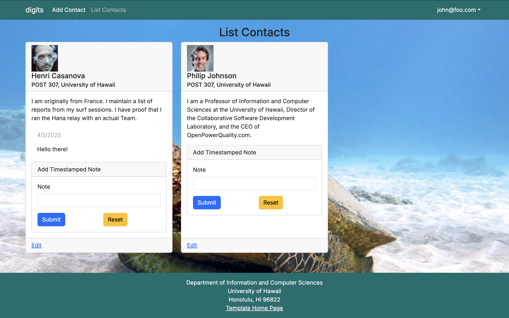

Digits is an application that allows users to:

- Register an account
- Create and manage a set of contacts
- Add a set of timestamped notes regarding their interactions with each contact

## Installation

First, [install PostgreSQL](https://www.postgresql.org/download/). Then create a database for your application.

```

$ createdb nextjs-application-template
Password:
$

```

Second, [download a copy of Digits](https://github.com/chaezenp/digits), and click the "Use this template" button. Complete the dialog box to create a new repository that you own that is initialized with this template's files.

Third, cd into your app/ directory to install the required libraries with:

```

$ npm install

```

Now once the libraries are installed, you can run the application by invoking:

```

$ npm run dev

> nextjs-application-template-1@0.1.0 dev
> next dev

▲ Next.js 17.2.4

- Local: http://localhost:3000
- Environments: .env

✓ Starting...
✓ Ready in 1619ms

```

### Viewing the running app

If all goes well, the template application will appear at [http://localhost:3000](http://localhost:3000). You can login using the credentials in [settings.development.json](https://github.com/ics-software-engineering/nextjs-application-template/blob/main/config/settings.development.json), or else register a new account.

### ESLint

You can verify that the code obeys our coding standards by running ESLint over the code in the src/ directory with:

```
$ npm run lint

> nextjs-application-template-1@0.1.0 lint
> next lint

✔ No ESLint warnings or errors
$
```

## Walkthrough of Application functionality

#### Landing page

When you retrieve the app at http://localhost:3000, this is what should be displayed:


The next step is to use the Login menu to either Login to an existing account or register a new account.

#### Login page

Clicking on the Login link, then on the Sign In menu item displays this page:


#### Register page

Alternatively, clicking on the Login link, then on the Sign Up menu item displays this page:


#### Landing (after Login) page, non-Admin user

Once you log in (either to an existing account or by creating a new one), the navbar changes as follows:


You can now add new Stuff documents, and list the Stuff you have created. Note you cannot see any Stuff created by other users.

#### Add Stuff page

After logging in, here is the page that allows you to add new Contacts:


#### List Stuff page

After logging in, here is the page that allows you to list all the Stuff you have created:



You click the "Edit" link to go to the Edit Stuff page, shown next.

#### Edit Stuff page

After clicking on the "Edit" link associated with an item, this page displays that allows you to change and save it:


#### Landing (after Login), Admin user

You can define an "admin" user in the settings.json file. This user, after logging in, gets a special entry in the navbar:


#### Admin page (list all users stuff)

To provide a simple example of a "super power" for Admin users, the Admin page lists all of the Stuff by all of the users:

